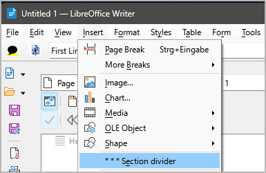

# novelibre-tools

OpenOffice/LibreOffice extension with tools for processing text documents in connection with 
[novelibre](https://github.com/peter88213/novelibre).

This extension adds menu entries to the **Format** and **Insert** menus of OpenOffice/LibreOffice *Writer*.

---

## Command reference

### Format > Replace section dividers with blank lines

This will replace the three-line "* * *" section dividers
with single blank lines. The style of the scene-dividing
lines will be changed from  _Heading 4_  to  _Heading 5_.
This helps to change the look of your final document.

### Insert > * * * Section divider

This will insert a "* * *" section divider, and 
apply the _Heading 4_ paragraph style. 
This is useful for setting up a "work in progress" written with 
*Writer* to create a new *novelibre* project.

**Note:** Before calling this command, 
make sure the cursor is on a blank line.

---

## Download and install

[Download extension](https://raw.githubusercontent.com/peter88213/novelibre-tools/main/dist/novelibre-tools-0.2.0.oxt)

* Installation right at download, by double-clicking on the downloaded file, or via the OpenOffice/LibreOffice Extension Manager.

## Credits

- [OpenOffice Extension Compiler](https://wiki.openoffice.org/wiki/Extensions_Packager#Extension_Compiler) by Bernard Marcelly.

## License

This extension is distributed under the [MIT License](http://www.opensource.org/licenses/mit-license.php).
