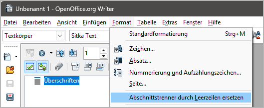

# novelibre-tools

OpenOffice/LibreOffice extension with tools for post-processing documents exported from 
[novelibre](https://github.com/peter88213/novelibre).

This extension adds a menu entry to the **Format** menu of OpenOffice/LibreOffice *Writer*:

There is also a translation into German:

### Format > Replace section dividers with blank lines

This will replace the three-line "* * *" section dividers
with single blank lines. The style of the scene-dividing
lines will be changed from  _Heading 4_  to  _Heading 5_.

## Download and install

[Download extension](https://raw.githubusercontent.com/peter88213/novelibre-tools/main/dist/novelibre-tools-0.1.4.oxt)

* Installation right at download, by double-clicking on the downloaded file, or via the OpenOffice/LibreOffice Extension Manager.

## Credits

- [OpenOffice Extension Compiler](https://wiki.openoffice.org/wiki/Extensions_Packager#Extension_Compiler) by Bernard Marcelly.

## License

This extension is distributed under the [MIT License](http://www.opensource.org/licenses/mit-license.php).
